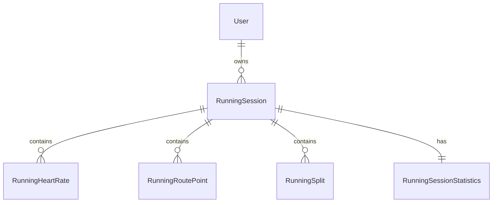

# Running Domain 설명 

## 📚 도메인 설명

TurtleRun 앱의 러닝 데이터는 다음과 같은 주요 도메인으로 구성되어 있습니다.

### 🏃‍♂️ RunningSession (러닝 세션)
러닝 활동의 기본 단위로, 하나의 러닝 활동에 대한 전반적인 정보를 포함합니다.

```java
주요 필드:
- startTime: 러닝 시작 시간
- endTime: 러닝 종료 시간
- duration: 총 러닝 시간 (초)
- activeDuration: 실제 움직인 시간 (초)
- distance: 이동 거리 (미터)
- totalCalories: 소모 칼로리
- averagePace: 평균 페이스 (분/km)
- bestPace: 최고 페이스 (분/km)
- averageSpeed: 평균 속도 (m/s)
- maxSpeed: 최고 속도 (m/s)
```

### ❤️ RunningHeartRate (심박수 데이터)
러닝 중 기록된 심박수 데이터입니다.

```java
주요 필드:
- heartRate: 심박수 (bpm)
- timestamp: 측정 시간
```

### 📍 RunningRoutePoint (경로 데이터)
러닝 경로의 각 지점에 대한 상세 정보입니다.

```java
주요 필드:
- latitude: 위도
- longitude: 경도
- altitude: 고도 (미터)
- speed: 해당 지점 속도 (m/s)
- verticalAccuracy: 고도 정확도
- horizontalAccuracy: 위치 정확도
- course: 이동 방향 (도)
```

### 🏃 RunningSplit (구간 기록)
1km 단위로 기록되는 구간별 상세 데이터입니다.

```java
주요 필드:
- splitDistance: 구간 거리 (미터)
- splitDuration: 구간 소요 시간 (초)
- splitPace: 구간 페이스 (분/km)
- averageHeartRate: 구간 평균 심박수
```

### 📊 RunningSessionStatistics (세션 통계)
러닝 세션의 전반적인 통계 정보입니다.

```java
주요 필드:
- averageStrideLength: 평균 보폭 (미터)
- averageGroundContactTime: 평균 지면 접촉 시간 (밀리초)
- averageVerticalOscillation: 평균 수직 진동 (센티미터)
- averagePower: 평균 파워 (와트)
- averageCadence: 평균 케이던스 (steps/minute)
- maxHeartRate: 최대 심박수
- averageHeartRate: 평균 심박수
- trainingEffect: 트레이닝 효과 (1.0-5.0)
- vo2max: VO2 Max 추정치
```

## 🔄 엔티티 관계도



## 📝 Repository 사용 예시


## 📈 확장 가능성

1. 실시간 데이터 처리
2. 배치 처리 최적화
3. 캐시 적용
4. 통계 데이터 집계
5. 성능 모니터링

## 🔒 보안 고려사항

1. 사용자 데이터 접근 제어
2. 민감 정보 암호화
3. API 접근 제한
4. 데이터 백업 전략
